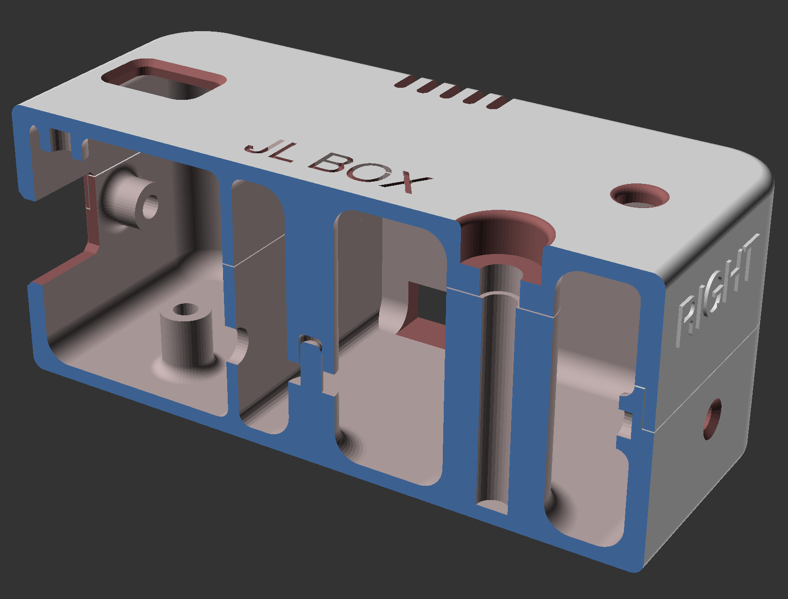
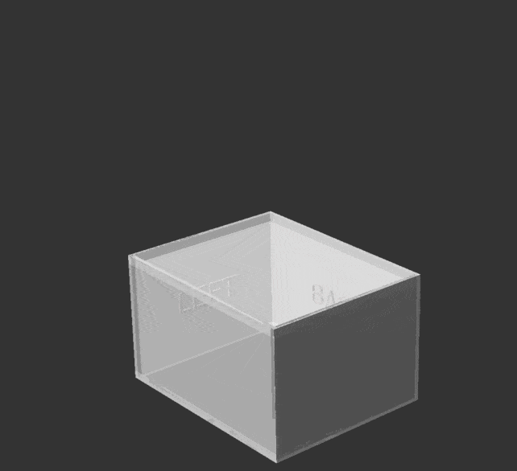
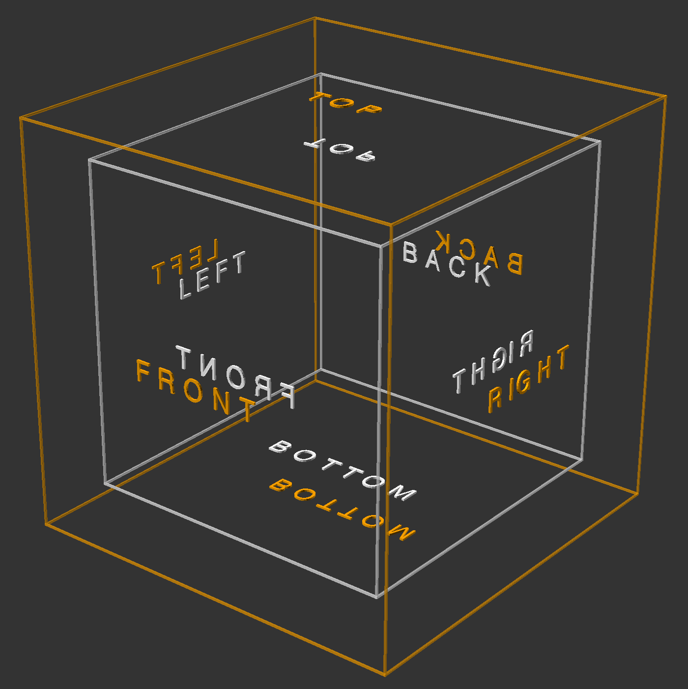
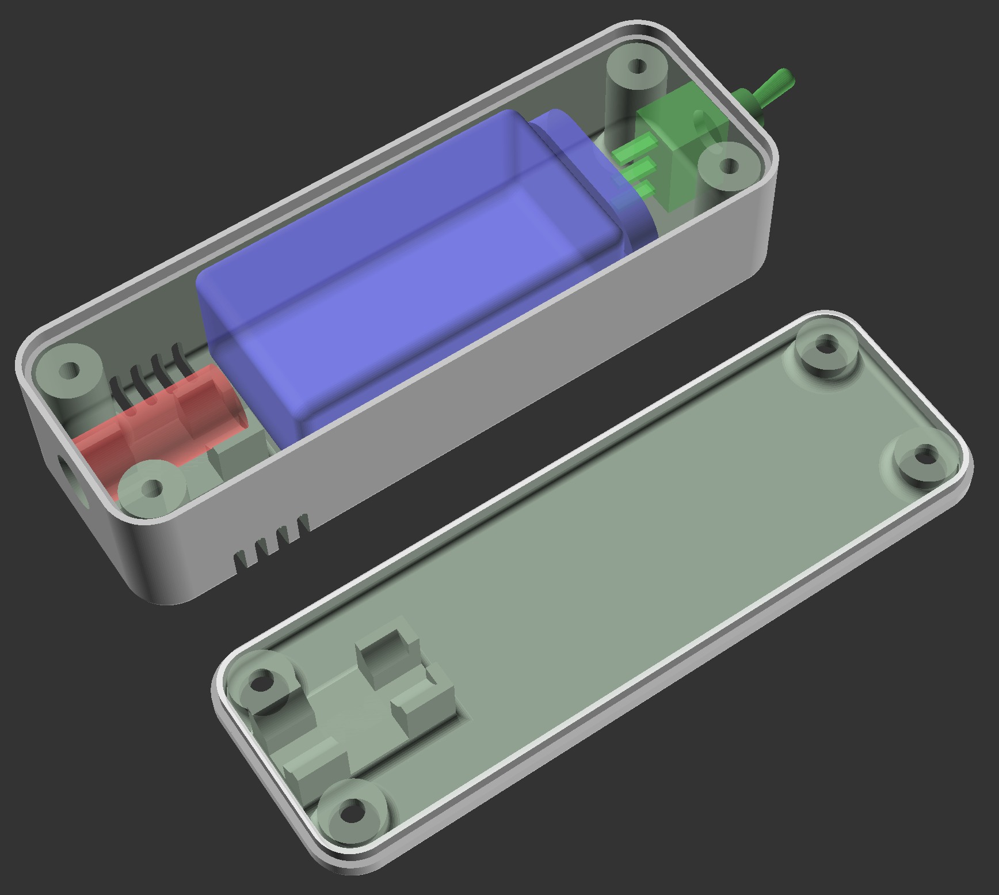
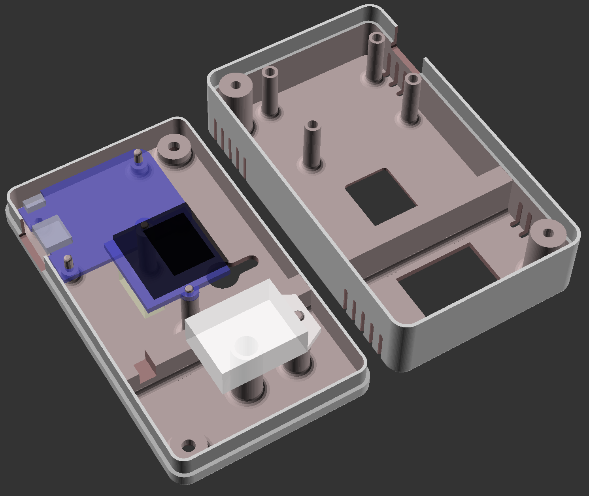
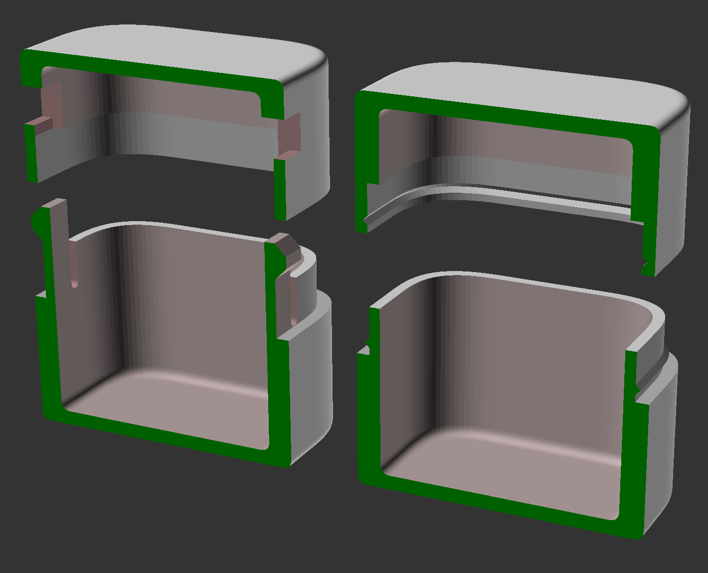

# JL_SCAD

Box enclosure library for [OpenSCAD](https://openscad.org) that make use of [BOSL2](https://github.com/BelfrySCAD/BOSL2/tree/master).

This library makes it simple to design enclosures for electronic projects, etc.



## Installation
Clone this git repo inside your OpenSCAD libraries folder.
You also need BOSL2 installed, latest version from git.

The latest development snapshot of OpenSCAD is recommended. Tested with version 2024.01.28.

## Basics

A box has 6 sides (left, right, front, back, bottom, top) and can be divided in any number of halves, for example base and lid. Each half can contain more than one side, for example both base and lid will also have left, right, front, and back sides.

Attached to the box are parts or components, mostly on the inside but they can also be on the outside.

The main module is `box_make()`, which takes a box shell child. It allows to generate all box halves, or only specified ones. It also lays them out as assembled, or for 3D printing.

The box shell module defines the box, and takes all the parts as children. There's currently only one box type included, but it's easy to add more.

To place parts, you use `box_half(half, inside=true)` to decide which box-half the part belongs to, and if it's on the inside (default) or outside. You can also give a list, or the BOX_ALL constant, as `half` to include the part in several halves.

This is followed by one or more `box_pos(anchor, side)` which takes one or more parts as children. The `anchor` defaults to CENTER and decides which box anchor to place the part at. `side` is a single face to decide how to orient the part(s), and defaults to the current `half`. The anchor is automatically adjusted according to `side`, so `side = LEFT` will include `LEFT` in the anchor, and orient the part so it points to the right. 

For convenience, there is also `box_part(side+half, anchor)` that wraps `box_half()` and `box_pos()`, and allows combining the box half and side in a single vector, so `BOT+FRONT` means the front side of the bottom box half. You can pass a list of such half+side vectors, to place a part at multiple sides. If the given side does not match any half, it's applied to all halves, so `LEFT` will mean the left side of both `BOT` and `TOP` halves in a base & lid box.

The most basic example looks like this:
```
include <jl_scad/box.scad>
include <jl_scad/parts.scad>

box_make(explode=30)
box_shell_base_lid([20,20,20])
{
    box_part(BOT, CENTER) cube(5,anchor=BOTTOM); // add a cube in the center of the base.
}
```

Use `box_cutout()` to easily create cutouts from a 2D path, or `box_cut()` to cut with any 3D shape. Cuts uses the standard BOSL2 diff(), with BOX_CUT_TAG and BOX_KEEP_TAG.

See the examples folder to learn more!

## Layout

A box can be displayed assembled, with variable `explode` amount:



Or laid out for printing:


## Compound parts

Sometimes it's useful to have a part that has both a half in the base and one half in the lid. These are simply modules that gather parts for both TOP and BOT sides. They should be made `attachable()` so that they react correctly on the positioning and orientation:

```
module my_compound_part(size, anchor=CENTER, spin=0, orient=UP) {
    inside_height = $parent_size.z;
    attachable(anchor, spin, orient, size=[size.x,size.y,inside_height]) {
        union() {
            box_part(BOT) cube(size, anchor=BOTTOM);
            box_part(TOP) cube([size.x, size.y, inside_height - size.z], anchor=BOTTOM);
        }
        children();
    }
}
```

Some included compound parts:

- `box_standoff_clamp()` - A standoff with a pin in the base and hole in the lid part, to clamp a PCB or similar in place.
- `box_scew_clamp()` - similar but with a screw hole in the base, to screw the base and lid together.

## Orientations
The `box_pos()` module automatically orient parts for the sides like below, with their bottom against the box face, either on inside (default) or outside. Note that parts oriented downwards are rotated around X-axis instead of Y-axis.



## Some examples
A [box for a laser module](examples/laserbox.scad), 9V battery, and toggle switch. The parts to be installed are show with `box_preview()` and shown transparent, and are not included in the final render.



A [box for D1 mini, OLED display and DHT22 sensor](examples/esp_oled_sensor_box.scad):



[Snap-fits](examples/snap_fit_test.scad):


